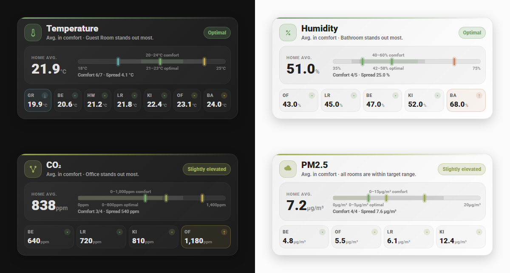

# Room Climate Card

[](https://hacs.xyz/docs/faq/custom_repositories)
[](https://community.home-assistant.io/t/i-made-a-room-climate-card-for-home-assistant-and-would-love-some-feedback/1020037)

[](https://my.home-assistant.io/redirect/hacs_repository/?owner=hyperfelixations&repository=room-climate-card&category=plugin)

A custom dashboard card for [Home Assistant](https://www.home-assistant.io/)
that shows the climate of one room or of your whole home: temperature,
humidity, CO₂, or PM2.5. It reads the current value from your sensors, puts it
on a scale with comfort and optimal ranges, and lists the individual rooms
below. The card follows your dashboard's light or dark theme.



## Features

- Four modes in one card: temperature, humidity, CO₂, and PM2.5, picked
  automatically from your sensors
- A whole-home value, either from one sensor of your own or averaged from the
  rooms you list
- A scale bar with comfort and optimal bands that stretches to fit the current
  values
- Room chips with a coldest/warmest comparison, wrapping into more rows as you
  add rooms — or laid out to a grid you choose
- Daily minimum/maximum views and a rate-of-change segment, when you have
  entities for them
- Colors and labels from a built-in profile — temperature comes with `indoor`,
  `outdoor`, and `fridge` — or from your own profile in YAML
- Rooms whose sensor is briefly unavailable stay on the card as `--` chips you
  can still tap
- Translated into 15 languages, following your Home Assistant language setting
- Plenty of optional YAML for views, bands, markers, footers, chips, the
  carousel, and tap/hold actions — see [Configuration](#configuration)

### Auto-slide in action

With more than one view enabled (here: the scale and room-comparison views), the card automatically rotates between them — swiping and tapping still work at any time:


## What you need

- **At least one sensor**: a main `entity`, one or more `rooms`, or both. The
  card reads the mode from a `device_class` of `temperature`, `humidity`,
  `carbon_dioxide`, or `pm25`, and falls back to a recognized unit such as
  `°C`, `%`, `ppm`, or `µg/m³`. In practice these are `sensor.*` entities.
- **A current browser.** There is no backend part and no minimum Home Assistant
  version — but the layout uses CSS container queries, so any currently
  supported version of Chrome, Edge, Firefox, or Safari.

## Installation

### HACS

[](https://my.home-assistant.io/redirect/hacs_repository/?owner=hyperfelixations&repository=room-climate-card&category=plugin)

Add Room Climate Card as a custom repository using the button above or
manually:

1. Open HACS → the three-dot menu → **Custom repositories**.
2. Add `https://github.com/hyperfelixations/room-climate-card`, category
   **Dashboard**.
3. Install "Room Climate Card" and reload your browser.

### Manual

1. Download
   [`room-climate-card.js`](https://github.com/hyperfelixations/room-climate-card/releases/latest/download/room-climate-card.js)
   from the latest release and copy it into your Home Assistant `www/` folder
   (e.g. `www/room-climate-card.js`).
2. Add it as a dashboard resource: Settings → Dashboards → the three-dot menu → **Resources** → add `/local/room-climate-card.js` as a JavaScript module.
3. Add a card with `type: custom:room-climate-card` to a dashboard.

## Quickstart

Pick the shape that matches what you have. You need at least one sensor.

### One sensor

```yaml
type: custom:room-climate-card
entity: sensor.house_temperature
```

Tapping the large value opens that entity. There is no caption above it —
nothing else on the card needs telling apart — unless you set `entity_label`.

### One room

```yaml
type: custom:room-climate-card
rooms:
  - name: Kitchen
    short: KI
    entity: sensor.kitchen_temperature
```

The room name becomes the caption, and tapping the large value opens that
room. Its chip is hidden by default, since it would just repeat the big number
— set `show_rooms: true` if you want it anyway.

Only entities Home Assistant knows count here. If you add a second room and
mistype its id, this stays a one-room card and the unknown id is named under
the title.

### Several rooms

```yaml
type: custom:room-climate-card
rooms:
  - name: Kitchen
    short: KI
    entity: sensor.kitchen_temperature
  - name: Bedroom
    short: BE
    entity: sensor.bedroom_temperature
```

The large value is the average of the rooms, so there is nothing to open by
tapping it. The chips still open their own rooms.

### One sensor plus rooms

```yaml
type: custom:room-climate-card
entity: sensor.house_temperature
rooms:
  - name: Kitchen
    short: KI
    entity: sensor.kitchen_temperature
  - name: Bedroom
    short: BE
    entity: sensor.bedroom_temperature
  - name: Living Room
    short: LR
    entity: sensor.living_room_temperature
```

Your sensor gives the large value; the rooms give the chips, the
coldest/warmest comparison, and the scale markers. If your main sensor drops
out for a while, the card averages the rooms instead.

See [Configuration](#configuration) below for every available option.

## Configuration

Everything except a source is optional — leave an option out and you get the
default.

### Top-level options

#### Data sources

| Option | Default | What it does |
| --- | --- | --- |
| `entity` | none | Your main or whole-home sensor. Its `device_class`, or its unit, decides whether this is a temperature, humidity, CO₂, or PM2.5 card. Leave it out and the rooms take over: one room is used directly, several are averaged. |
| `rooms` | `[]` | Your room sensors. From two rooms with values on, you get the comparison features and the `extremes` view. Each room needs its own `entity` — see [Room entries](#room-entries). |
| `range_entity` | none | A sensor holding todays range as its state, with `minimum` and `maximum` attributes for the two values. Add `minimum_zeitpunkt` and `maximum_zeitpunkt` attributes if you also want the times. |
| `trend_entity` | none | A rate-of-change sensor in a unit that matches, for example `°C/h`. You get a rising, stable, or falling arrow above the large value, plus the rate in the scale footer. |
| `classification` | `auto` + metric default | Decides where the colors and level names come from. A plain string such as `outdoor` picks a built-in profile. See [Classification](#classification). |

Small changes count as stable rather than as a trend, so the arrow does not
flicker — for temperature, anything within about `±0.1 °C/h`. The arrow appears
above the value; the signed rate needs the main scale footer, which in turn
needs at least two rooms with values.

#### Text, language, and number display

| Option | Default | What it does |
| --- | --- | --- |
| `title` | automatic | Replaces the card title, which otherwise names the measurement — “Temperature”, for example. |
| `entity_label` | automatic | Sets the small caption above the large value. `entity_label: ""` removes it. Left out, a single-room card uses that room's name, a card with only `entity` has no caption, and a card with rooms uses the translated "Home avg." caption. |
| `icon` | automatic | Pins the header icon to an `mdi:*` icon of your choice, for example `mdi:home-thermometer`. Otherwise it follows the current value. |
| `decimals` | mode-dependent | Sets `0`, `1`, or `2` decimal places for the large value, the room chips, the daily minimum/maximum, the spread, and the trend. Defaults: `0` for CO₂, `1` for the others. Scale and band labels stay whole numbers. |
| `language` | `auto` | Forces one of `en`, `de`, `nl`, `fr`, `it`, `es`, `ru`, `pl`, `uk`, `ko`, `ja`, `zh`, `nb`, `sv`, `lv`. `auto` follows your Home Assistant language. |

#### Room-chip display

| Option | Default | What it does |
| --- | --- | --- |
| `room_sort` | `value_asc` | Orders the chips by `value_asc`, `value_desc`, `name`, or the `configured` order. Sorting is display only — it does not change which room counts as coldest or warmest. |
| `room_label` | `auto` | Chooses the chip text: `auto` and `short` use `rooms[].short`; `name` uses `rooms[].name`. |
| `show_rooms` | `auto` | Controls the chip grid only: `auto` hides the one chip that would just repeat the large value on a single-room card and shows chips otherwise; `true` always shows them; `false` never does. Rooms still feed the comparisons either way. |
| `unavailable_values` | `show` | `show` gives a room whose sensor is unavailable or non-numeric a neutral, tappable `--` chip; `hide` leaves it out. A room whose entity Home Assistant does not know, or whose unit does not fit, is never shown as a chip. |
| `room_columns` | automatic | Sets `1`–`20` grid columns. If `room_rows` is omitted, enough rows are added automatically. |
| `room_rows` | automatic | Sets `1`–`20` grid rows. If `room_columns` is omitted, enough columns are added automatically. |

Setting both `room_columns` and `room_rows` caps how many chips are drawn — the
first ones in your `rooms:` order. Hiding a chip is only visual: every room you
configure keeps counting towards the average, the coldest/warmest comparison,
the spread, and the scale markers.

Which layouts show chips:

| Your sources | `auto` | `true` | `false` |
| --- | --- | --- | --- |
| Only `entity` | hidden | hidden | hidden |
| One room | hidden | shown | hidden |
| Several rooms | shown | shown | hidden |
| `entity` plus rooms | shown | shown | hidden |

`--` placeholders follow the same rules and sit after the rooms that do have a
value. They are tappable, but a value the card cannot read is left out of every
calculation.

#### Carousel, footers, and actions

| Option | Default | What it does |
| --- | --- | --- |
| `auto_slide` | `true` | `false` stops automatic movement between views. It does not disable manual swiping. |
| `swipe` | `true` | `false` disables horizontal swipe navigation. It does not stop automatic movement or tap/hold actions. |
| `rotation_seconds` | `14` | Seconds a view remains visible before automatic movement. Accepted range: `1`–`3600`. |
| `slide_seconds` | `1` | Duration of the slide transition. Accepted range: `0.1`–`10`. |
| `hide_footer` | `false` | `true` hides both footers at once. Use the per-view `footer` option to hide only one of them. |
| `tap_action` | `more-info` | What a tap on the large value or a chip does. |
| `hold_action` | `more-info` | The same for a long press. |
| `views` | automatic | Chooses which views appear, in which order, with which options. Write it and it is the full list — see [Views](#views). |
| `start_view` | first active view | The view the card starts on: `range`, `range_scale`, `scale`, or `extremes`. If that one is not available, the first active view is used. |

`auto_slide` and `swipe` are independent. For example, this creates a
manually swipeable carousel that never advances on its own:

```yaml
auto_slide: false
swipe: true
```

### Room entries

Each item under `rooms:` supports:

| Room field | Required | What it does |
| --- | --- | --- |
| `entity` | yes | Unique room sensor entity ID. |
| `name` | no | Full room name used in tooltips, extrema, and when `room_label: name` is selected. Falls back to `short`, then to the entity ID. |
| `short` | no | Short chip label. Falls back to `name`, then to the entity ID. |
| `tap_action` | no | Action for this room only. Inherits the card-level `tap_action` when omitted or invalid. |
| `hold_action` | no | Hold action for this room only. Inherits the card-level `hold_action` when omitted or invalid. |

Example:

```yaml
tap_action:
  action: more-info
hold_action:
  action: none

rooms:
  - name: Kitchen
    short: KI
    entity: sensor.kitchen_temperature
    tap_action:
      action: navigate
      navigation_path: /lovelace/kitchen
```

Accepted `action` values are `more-info`, `toggle`, `perform-action`,
`navigate`, `url`, `assist`, and `none`. Other action-specific fields are
passed to Home Assistant. The default is `more-info`; `none` disables that
interaction.

### Views

Without a `views:` section, the card keeps its automatic behavior:

- `range` appears when a usable `range_entity` is available.
- `scale` appears by default.
- `extremes` appears with at least two usable room values.
- `range_scale` is optional and does not appear automatically.

Available view types:

| View | Availability | Purpose |
| --- | --- | --- |
| `range` | Usable `range_entity` | Two cards for today's minimum and maximum. |
| `range_scale` | Usable `range_entity` with valid `minimum`/`maximum` | Alternate scale with current, daily-minimum, and daily-maximum markers. It stays off when `views:` is omitted, but listing it explicitly enables it. |
| `scale` | Always available | Main dynamic scale with configurable average, extrema, or per-room markers. |
| `extremes` | At least two usable room values | Coldest and warmest room cards. |

A string and an object without `enabled` both explicitly enable the listed
view:

```yaml
views:
  - range
  - scale
  - extremes
```

Use the object form to set `enabled` or `options`:

```yaml
views:
  - type: range
    enabled: auto
  - type: range_scale
  - type: scale
  - type: extremes
    enabled: auto
```

`enabled` accepts `true`, `false`, or `auto`. Leaving it out means `true`; use
`auto` to let the card decide as it would without a `views:` section. A view you
enable still needs its entities to actually appear.

Once you write a `views:` section, it is the full list: the card shows exactly
those views, in exactly that order, and adds nothing on its own.

#### View-specific options

Options belong inside the corresponding `views:` entry. All defaults preserve
the card's original behavior.

| View | Option | Values | Default | Effect |
| --- | --- | --- | --- | --- |
| `range` | `show_time` | `true` / `false` | `true` | Hides the min/max timestamps but keeps the values. |
| `range_scale` | `show_comfort_band` | `true` / `false` | `true` | Shows or hides the comfort band. This view has no separate comfort label. |
| `range_scale` | `show_optimal_band` | `true` / `false` | `true` | Shows or hides both the optimal band and its label. |
| `range_scale` | `footer` | `detailed` / `compact` / `false` | `detailed` | Full footer with times, shorter footer without times, or no footer. Global `hide_footer: true` always wins. |
| `scale` | `show_comfort_band` | `true` / `false` | `true` | Shows or hides both the comfort band and its label. |
| `scale` | `show_optimal_band` | `true` / `false` | `true` | Shows or hides both the optimal band and its label. |
| `scale` | `footer` | `true` / `false` | `true` | Shows or hides the comfort/spread/trend footer under this scale. It needs at least two rooms with values, and `hide_footer: true` overrides it. The trend arrow above the value is separate. |
| `scale` | `markers` | `extremes` / `average` / `all` | `extremes` | `extremes` shows the lowest room, average, and highest room (the default); `average` shows only the average; `all` shows a smaller marker for every currently valid configured room plus a larger average marker. |
| `extremes` | `show_value` | `true` / `false` | `true` | Hides the numbers but keeps the coldest/warmest labels and the room names. |

Options apply to their own view only, and you can combine them freely:

```yaml
views:
  - type: range_scale
    options:
      show_comfort_band: false
      show_optimal_band: true
      footer: compact

  - type: scale
    options:
      show_comfort_band: false
      show_optimal_band: false
      footer: false
      markers: average
```

Hiding a band only hides the band. The thresholds behind it still decide the
colors, the classification, and where the markers sit.

### Classification

With no `classification` option, the card uses `source: auto`: a live entity
classification is accepted only when both `value_color` and `value_level` are
present and valid. Otherwise the complete numeric fallback profile is used.

Temperature uses `indoor` by default. Select the built-in outdoor profile with
the short form:

```yaml
classification: outdoor
```

The outdoor profile uses an optimal band of `18–22 °C` and a comfort band of
`14–26 °C`. Its scale has no fixed range: both ends follow whatever your
sensors currently report, which is what you want outdoors, where summer and
winter are nowhere near each other. A band that is completely off the current
scale is hidden until the values reach it.

Select the built-in fridge profile the same way, for monitoring an appliance
instead of a room:

```yaml
classification: fridge
```

The fridge profile aims at food safety rather than comfort: an optimal band of
`3–5 °C` and a comfort band of `1–6 °C`, with more room above the band than
below, because getting too warm is what spoils food. Its scale stays fixed at
`0–8 °C` — a fridge does not need a scale that follows the weather.

The header icon follows the active profile unless you set `icon` yourself:
temperature moves through thermometer, fire, and snowflake icons; humidity
through the water-percent variants; CO₂ switches to an alert icon at its
highest tier; and PM2.5 goes from molecule through haze and dust to alert.

The full object form gives you four choices:

```yaml
# Complete entity attributes, then the selected built-in fallback.
classification:
  source: auto
  profile: outdoor

# Entity attributes only. Incomplete attributes stay neutral.
classification:
  source: entity

# Ignore entity classification and force the built-in profile.
classification:
  source: profile
  profile: outdoor
```

`auto` and `profile` use the metric's default profile when `profile` is
omitted. `outdoor` and `fridge` are currently available only for
temperature; `indoor` is the default profile for temperature, humidity,
CO₂, and PM2.5.

A custom profile is authoritative: it ignores entity classification and owns
tiers, bands, base scale, and temperature icon thresholds together.

```yaml
classification:
  source: custom
  unit: "°C"
  comparison: ">="

  bands:
    comfort:
      min: 14
      max: 26
    optimal:
      min: 18
      max: 22

  scale:
    min: 10
    max: 30
    step: 1

  icons:
    fire: 35
    high: 30
    normal: 14
    low: 5

  tiers:
    - min: 30
      score: 6
      level: Very hot
      color: "#B85F67"
      zone: outside
    - min: 26
      score: 5
      level: Warm
      color: "#C0A752"
      zone: outside
    - min: 22
      score: 4
      level: Slightly warm
      color: "#9DA85A"
      zone: comfort
    - min: 18
      score: 3
      level: Comfortable
      color: "#79A86C"
      zone: optimal
    - min: 14
      score: 2
      level: Slightly cool
      color: "#69A78B"
      zone: comfort
    - default: true
      score: 1
      level: Cold
      color: "#8192C8"
      zone: outside
```

Custom-profile rules:

- `unit` must be a unit the card knows for this measurement. Temperature takes
  Celsius, Fahrenheit, or Kelvin, and the whole profile is converted to
  whatever unit your sensors use.
- `comparison` is `>=` by default and may be `>`.
- Tier `min` values must be unique and strictly descending. Exactly one final
  `{default: true}` tier is required.
- Every tier requires a finite numeric `score`, a non-empty `level`, a safe
  3/4/6/8-digit hex `color`, and `zone: optimal | comfort | outside |
  invalid`.
- The optimal band must be inside the comfort band; the base scale must
  contain both. `scale.step` must be greater than zero.
- Optional `scale.headroom` must be non-negative; `scale.one_sided` is a
  boolean.
- `icons` is optional; its shape depends on the profile's metric kind.
  Temperature takes an object of descending `fire`, `high`, `normal`, and
  `low` thresholds — without it, temperature derives them from the custom
  scale and comfort bounds. Humidity, CO₂, and PM2.5 instead take a
  descending list of `{min, icon}` tiers with a final `{default: true,
  icon: ...}` entry, the same shape as `tiers` without the color/level/zone
  fields, for example:
  ```yaml
  icons:
    - min: 60
      icon: mdi:water-percent-alert
    - min: 30
      icon: mdi:water-percent
    - default: true
      icon: mdi:water-minus
  ```
  Without it, these three metrics keep their fixed default header icon.
- Optional `valid_range` accepts `min`, `max`, `min_inclusive`, and
  `max_inclusive`.
- A mistake inside `classification` stops the card with an error naming the
  exact option, so a typo never quietly changes what a color means.

### What the card checks, and what it decides for you

A mistake that would make the card meaningless stops it with an error naming
the option: no source at all, a `rooms:` that is not a list, a room without an
entity, duplicate room entities, or a malformed `entity`. A mistake in a purely
cosmetic option falls back to the default, and an unknown `views:` entry or
option key is skipped with a note in the browser console.

Three things the card decides on its own:

- which metric it is showing, and the unit it displays;
- converting a profile written in one unit to the unit your sensors use;
- how far the scale stretches beyond a profile's range to fit your values.

Colors, levels, and bands come from one place: the `classification` option
above. A profile owns all of them together, so you switch profiles rather than
overriding single pieces.

### Full example

This example shows how the different groups of options can be combined. You
only need to keep the parts you want to customize.

```yaml
type: custom:room-climate-card
entity: sensor.house_temperature
range_entity: sensor.house_temperature_daily_range
trend_entity: sensor.house_temperature_trend
classification: indoor

title: Indoor climate
entity_label: Home average
decimals: 1
language: auto

rooms:
  - name: Kitchen
    short: KI
    entity: sensor.kitchen_temperature
  - name: Bedroom
    short: BE
    entity: sensor.bedroom_temperature
room_sort: name
room_label: name
show_rooms: true
unavailable_values: show
room_columns: 4

auto_slide: false
swipe: true
rotation_seconds: 14
slide_seconds: 1

start_view: scale
views:
  - type: range
    options:
      show_time: false
  - type: range_scale
    options:
      show_comfort_band: true
      show_optimal_band: true
      footer: compact
  - type: scale
    options:
      show_comfort_band: false
      show_optimal_band: true
      footer: true
      markers: average
  - type: extremes
    options:
      show_value: true
```

## Known limitations

- There is no visual editor — everything is YAML. Start with the
  [Quickstart](#quickstart) and use the [Configuration](#configuration)
  reference from there.
- In some layouts, four-digit CO₂ values and two-digit PM2.5 values can get
  clipped. Widening the card usually helps for now.
- Daily minimum/maximum and trend need their own entities. The card reads what
  Home Assistant reports right now; it does not look at history itself. Those
  entities are usually template sensors — I plan to publish the ones I use.
- One card shows one kind of measurement. Rooms measuring something else, or
  using a unit that does not fit, are left out. If there is no main entity and
  the rooms disagree about what they measure, the card says so instead of
  picking a winner.

## Troubleshooting

**The card doesn't appear after installing.**
Confirm the dashboard resource was actually added (Settings → Dashboards →
the three-dot menu → **Resources**) and points at the right path/module
type, then do a hard browser reload (see below). After a HACS install, a
normal Home Assistant restart or resource re-registration is usually
enough; a manual install needs the resource step from
[Installation](#installation) done explicitly.

**Changes don't show up, or the card looks outdated after an update.**
Browsers aggressively cache dashboard resources. Hard-reload the dashboard
tab (Ctrl+Shift+R / Cmd+Shift+R), or clear the browser cache for your Home
Assistant URL, after installing or updating the card.

**"Custom element doesn't exist: room-climate-card".**
Check the card's `type:` — it must be exactly `custom:room-climate-card`
(the `custom:` prefix is required), and the resource must have loaded
without a console error.

**The card shows “No data” and `--` as its large value.**
None of your sources has a usable number right now, or the card cannot tell
what they measure. The line under the title says which. Three different
situations:

- **A typo, or an entity that no longer exists.** Home Assistant does not know
  the id at all, so the card does not treat it as a source: no chip, and the id
  is named under the title. A card with one working room and one mistyped one
  is a one-room card.
- **A sensor that is `unavailable`, `unknown`, or reporting something that is
  not a number.** The entity exists, so it keeps its place as a `--` chip and
  the card keeps its layout. Use `unavailable_values: hide` to leave those
  chips out.
- **A sensor measuring something else, or using a unit that does not fit.** It
  is left out of this card.

If everything looks right, check that your sensors have a `device_class` of
`temperature`, `humidity`, `carbon_dioxide`, or `pm25`, or at least a unit the
card recognizes (see [What you need](#what-you-need)).

**Something broke after updating the card.**
Hard-reload the dashboard first (see above — a stale cached version is the
most common cause). If the problem persists, open your browser's developer
console and check for an error message before reporting it.

If none of this helps, please open a
[GitHub issue](https://github.com/hyperfelixations/room-climate-card/issues) and include:

- your Home Assistant version;
- the card version (open your browser's developer console, type
  `roomClimateCardVersion`, and press Enter);
- your browser and its version;
- the relevant part of your card's YAML configuration;
- any error message from the browser console.

## Links

- [Releases](https://github.com/hyperfelixations/room-climate-card/releases) — every
  version, with its notes and its download
- [Issues](https://github.com/hyperfelixations/room-climate-card/issues)
- [License](LICENSE) (MIT)
