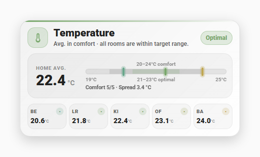
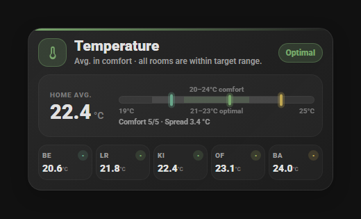
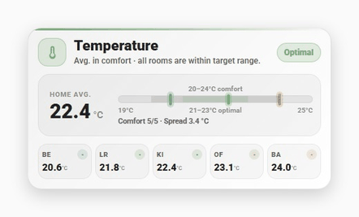

# Room Climate Card

[](https://hacs.xyz/docs/faq/custom_repositories)
[](LICENSE)

A custom [Home Assistant](https://www.home-assistant.io/) dashboard card for a compact, at-a-glance view of a room's or your whole home's climate: temperature, humidity, CO₂, or PM2.5 — auto-detected from the configured entities. It automatically adapts to your dashboard's light or dark mode.




## Features

- One card, four modes: temperature, humidity, CO₂, PM2.5 (detected from the usable primary entity's `device_class`, with unit and compatible-room fallbacks)
- Optional per-room breakdown with a coldest/warmest room comparison, shown as a swipeable/auto-rotating carousel alongside the main scale, automatically wrapping into multiple rows past 7 rooms (or laid out to an explicit grid you choose)
- Optional daily range (min/max) views and a compact rate-of-change segment
  in the main scale footer, when the matching entities are configured
- Optional alternate scale view showing today's min/max instead of the room comparison
- A dynamic scale bar with comfort and optimal bands that expand to fit the current values
- Profile-driven header icons for temperature, humidity, CO₂, and PM2.5
- A configurable classification policy: complete `value_color`/`value_level`
  entity attributes, built-in profiles, or a strictly validated custom YAML
  profile. Temperature includes `indoor`, `outdoor`, and `fridge` profiles.
- Built-in UI in English, German, Dutch, French, Italian, Spanish, Russian, Polish, Korean, Japanese, Simplified Chinese, Norwegian Bokmål, Swedish, and Latvian, following Home Assistant's language setting — falls back to English for any other language
- Extensive optional YAML customization for views, bands and labels, markers,
  footers, room chips, carousel behavior, language, and tap/hold actions (see
  [Configuration](#configuration))

### Auto-slide in action

With more than one view enabled (here: the scale and room-comparison views), the card automatically rotates between them — swiping and tapping still work at any time:



## Requirements

- **Entities**: any numeric sensor-like entity works. A usable primary entity's
  `device_class: temperature | humidity | carbon_dioxide | pm25` selects the
  mode; without a recognized `device_class`, a recognized unit (e.g. `°C`,
  `%`, `ppm`, `µg/m³`) is used. If the primary value is unavailable or invalid,
  compatible usable rooms can supply a room-consensus average. There is no fixed
  domain restriction, but `sensor.*` entities are the practical case.
- **Home Assistant / browser**: no minimum Home Assistant version is
  enforced — the card is a dependency-free custom element with no backend
  integration. It does use CSS container queries for its responsive
  layout, so the dashboard needs a reasonably current browser (any
  currently supported version of Chrome, Edge, Firefox, or Safari).
## Installation

### HACS

[](https://my.home-assistant.io/redirect/hacs_repository/?owner=hyperfelixations&repository=room-climate-card&category=plugin)

Add Room Climate Card as a custom repository using the button above or
manually:

1. Open HACS → the three-dot menu → **Custom repositories**.
2. Add `https://github.com/hyperfelixations/room-climate-card`, category
   **Dashboard**.
3. Install "Room Climate Card" and reload your browser.

### Manual

1. Download the repository's built
   [`dist/room-climate-card.js`](dist/room-climate-card.js) file and copy it
   into your Home Assistant `www/` folder (e.g. `www/room-climate-card.js`).
2. Add it as a dashboard resource: Settings → Dashboards → the three-dot menu → **Resources** → add `/local/room-climate-card.js` as a JavaScript module.
3. Add a card with `type: custom:room-climate-card` to a dashboard.

## Quickstart

The only required option is `entity`:

```yaml
type: custom:room-climate-card
entity: sensor.house_temperature
```

A few rooms for the coldest/warmest comparison and chip grid:

```yaml
type: custom:room-climate-card
entity: sensor.house_temperature
rooms:
  - name: Kitchen
    short: KI
    entity: sensor.kitchen_temperature
  - name: Bedroom
    short: BE
    entity: sensor.bedroom_temperature
  - name: Living Room
    short: LR
    entity: sensor.living_room_temperature
```

Humidity mode with a daily range view:

```yaml
type: custom:room-climate-card
entity: sensor.house_humidity
range_entity: sensor.house_humidity_daily_range
views:
  - range_scale
  - extremes
```

See [Configuration](#configuration) below for every available option.

## Configuration

Only `entity` is required. Everything else is optional, and omitting an
option keeps the card's default behavior.

### Top-level options

#### Data sources

| Option | Default | What it does |
| --- | --- | --- |
| `entity` | required | The main or whole-home sensor. Its `device_class`, or its unit as a fallback, selects temperature, humidity, CO₂, or PM2.5 mode. |
| `rooms` | `[]` | A list of room sensors. Two or more currently valid room values enable room comparison features and the `extremes` view. Each room needs a unique `entity`; see [Room entries](#room-entries). |
| `range_entity` | none | A daily-range sensor. Its state should be the numeric range; `minimum` and `maximum` attributes supply the daily values. Optional `minimum_zeitpunkt` and `maximum_zeitpunkt` attributes supply their times. |
| `trend_entity` | none | A rate-of-change sensor compatible with the selected metric, for example `°C/h`. A valid value adds a localized third segment to the room-bound main scale footer, while a rising, stable, or falling arrow appears above the average unit. |
| `classification` | `auto` + metric default | Selects how entity attributes and numeric profiles are resolved. A string such as `outdoor` is shorthand for automatic entity-first resolution with that built-in fallback profile. See [Classification](#classification). |

Trend direction uses a metric-specific stable deadband. Values exactly on a
boundary are stable:

| Mode | Falling | Stable | Rising |
| --- | --- | --- | --- |
| Temperature | below `-0.1 °C/h` | `-0.1` through `+0.1 °C/h` | above `+0.1 °C/h` |
| Humidity | below `-0.5 %/h` | `-0.5` through `+0.5 %/h` | above `+0.5 %/h` |
| CO₂ | below `-25 ppm/h` | `-25` through `+25 ppm/h` | above `+25 ppm/h` |
| PM2.5 | below `-0.5 µg/m³/h` | `-0.5` through `+0.5 µg/m³/h` | above `+0.5 µg/m³/h` |

The direction indicator is a theme-colored inline SVG rather than a Unicode
character, so it renders consistently without turning into an emoji. The
average keeps its original compact label-and-value layout with or without a
trend. The signed rate is visible only when the main scale footer itself is
available (at least two valid rooms and no global or per-view footer override);
minimal mode still shows the direction arrow but has no separate rate label.

Classification always happens in the metric's canonical rate unit before the
number is converted for display. A Fahrenheit card therefore uses the same
physical temperature boundary, displayed as approximately `±0.18 °F/h`.
Missing, unavailable, non-numeric, unitless, or incompatible trend entities
do not add an empty placeholder.

#### Text, language, and number display

| Option | Default | What it does |
| --- | --- | --- |
| `title` | automatic | Replaces the mode-dependent card title, such as “Temperature”. |
| `avg_label` | translated default | Replaces the label above the large main value. This is useful when the card represents one room rather than a whole-home average. |
| `icon` | automatic | Replaces the header icon with an `mdi:*` icon, for example `mdi:home-thermometer`. Without an override, all four metric modes use their profile-driven value icon. |
| `decimals` | mode-dependent | Sets `0`, `1`, or `2` decimal places for values such as the average, rooms, daily extremes, spread, and trend. Default per mode: `0` for CO₂, `1` for temperature, humidity, and PM2.5. Scale boundary and comfort/optimal range labels intentionally remain whole numbers. |
| `language` | `auto` | Uses `en`, `de`, `nl`, `fr`, `it`, `es`, `ru`, `pl`, `ko`, `ja`, `zh`, `nb`, `sv`, or `lv`. `auto` follows Home Assistant's language; an unsupported value also falls back to automatic detection. |

#### Room-chip display

| Option | Default | What it does |
| --- | --- | --- |
| `room_sort` | `value_asc` | Orders visible chips by `value_asc`, `value_desc`, `name`, or `configured` order. This never changes the coldest/warmest room, comfort count, spread, or scale calculations. |
| `room_label` | `auto` | Chooses the chip text: `auto` and `short` use `rooms[].short`; `name` uses `rooms[].name`. |
| `show_rooms` | `true` | `false` hides only the room-chip grid. All configured rooms remain data sources for extrema, comfort count, spread, markers, and views. |
| `room_columns` | automatic | Sets `1`–`20` grid columns. If `room_rows` is omitted, enough rows are added automatically. |
| `room_rows` | automatic | Sets `1`–`20` grid rows. If `room_columns` is omitted, enough columns are added automatically. |

If both `room_columns` and `room_rows` are set, their product is the maximum
number of visible chips. The visible set is taken from `rooms:` in configured
order before `room_sort` is applied. Rooms hidden only by this visual grid cap
still participate in extrema, comfort, spread, and scale calculations.

#### Carousel, footers, and actions

| Option | Default | What it does |
| --- | --- | --- |
| `auto_slide` | `true` | `false` stops automatic movement between views. It does not disable manual swiping. |
| `swipe` | `true` | `false` disables horizontal swipe navigation. It does not stop automatic movement or tap/hold actions. |
| `rotation_seconds` | `14` | Seconds a view remains visible before automatic movement. Accepted range: `1`–`3600`. |
| `slide_seconds` | `1` | Duration of the slide transition. Accepted range: `0.1`–`10`. |
| `hide_footer` | `false` | `true` globally hides both the main scale footer and the daily range-scale footer. View-specific footer options can hide one footer without hiding the other. |
| `tap_action` | `more-info` | Default Home Assistant action for a tap on a clickable card element. |
| `hold_action` | `more-info` | Home Assistant action for a hold. |
| `views` | automatic | Selects, orders, enables, and customizes views. Once present, the list is authoritative; see [Views](#views). |
| `start_view` | first active view | Preferred resting/start view: `range`, `range_scale`, `scale`, or `extremes`. If it is unavailable, the first active view is used. |

`auto_slide` and `swipe` are independent. For example, this creates a
manually swipeable carousel that never advances on its own:

```yaml
auto_slide: false
swipe: true
```

### Room entries

Each item under `rooms:` supports:

| Room field | Required | What it does |
| --- | --- | --- |
| `entity` | yes | Unique room sensor entity ID. |
| `name` | no | Full room name used in tooltips, extrema, and when `room_label: name` is selected. Falls back to `short`, then to the entity ID. |
| `short` | no | Short chip label. Falls back to `name`, then to the entity ID. |
| `tap_action` | no | Action for this room only. Inherits the card-level `tap_action` when omitted or invalid. |
| `hold_action` | no | Hold action for this room only. Inherits the card-level `hold_action` when omitted or invalid. |

Example:

```yaml
tap_action:
  action: more-info
hold_action:
  action: none

rooms:
  - name: Kitchen
    short: KI
    entity: sensor.kitchen_temperature
    tap_action:
      action: navigate
      navigation_path: /lovelace/kitchen
```

Accepted `action` values are `more-info`, `toggle`, `perform-action`,
`navigate`, `url`, `assist`, and `none`. Other action-specific fields are
passed to Home Assistant. The default is `more-info`; `none` disables that
interaction.

### Views

Without a `views:` section, the card keeps its automatic behavior:

- `range` appears when a usable `range_entity` is available.
- `scale` appears by default.
- `extremes` appears with at least two usable room values.
- `range_scale` is optional and does not appear automatically.

Available view types:

| View | Availability | Purpose |
| --- | --- | --- |
| `range` | Usable `range_entity` | Two cards for today's minimum and maximum. |
| `range_scale` | Usable `range_entity` with valid `minimum`/`maximum` | Alternate scale with current, daily-minimum, and daily-maximum markers. It stays off when `views:` is omitted, but listing it explicitly enables it. |
| `scale` | Always available | Main dynamic scale with configurable average, extrema, or per-room markers. |
| `extremes` | At least two usable room values | Coldest and warmest room cards. |

If a daily minimum or maximum label would collide with the fixed current
label, only that historical label moves to the upper line. The upper label
remains fully readable; this paint-only fallback does not move the scale bar,
markers, or the other historical label.

A string and an object without `enabled` both explicitly enable the listed
view:

```yaml
views:
  - range
  - scale
  - extremes
```

Use the object form to set `enabled` or `options`:

```yaml
views:
  - type: range
    enabled: auto
  - type: range_scale
  - type: scale
  - type: extremes
    enabled: auto
```

`enabled` accepts `true`, `false`, or `auto`. Omitted means `true`; write
`enabled: auto` only when the view should defer to its registry default.
Availability requirements still apply to an explicitly enabled view. When
`views:` is present, only listed views can
appear, in exactly the listed order; omitted views are not added
automatically.

#### View-specific options

Options belong inside the corresponding `views:` entry. All defaults preserve
the card's original behavior.

| View | Option | Values | Default | Effect |
| --- | --- | --- | --- | --- |
| `range` | `show_time` | `true` / `false` | `true` | Shows or hides the min/max timestamps; values remain visible. |
| `range_scale` | `show_comfort_band` | `true` / `false` | `true` | Shows or hides the comfort band. This view has no separate comfort label. |
| `range_scale` | `show_optimal_band` | `true` / `false` | `true` | Shows or hides both the optimal band and its label. |
| `range_scale` | `footer` | `detailed` / `compact` / `false` | `detailed` | Full footer with times, shorter footer without times, or no footer. Global `hide_footer: true` always wins. |
| `scale` | `show_comfort_band` | `true` / `false` | `true` | Shows or hides both the comfort band and its label. |
| `scale` | `show_optimal_band` | `true` / `false` | `true` | Shows or hides both the optimal band and its label. |
| `scale` | `footer` | `true` / `false` | `true` | Shows or hides this view's comfort/spread/trend-rate footer. The footer also requires room comparison data, and global `hide_footer: true` always wins. The trend direction arrow above the average unit remains independent. |
| `scale` | `markers` | `extremes` / `average` / `all` | `extremes` | `extremes` shows the lowest room, average, and highest room (the default); `average` shows only the average; `all` shows a smaller marker for every currently valid configured room plus a larger average marker. |
| `extremes` | `show_value` | `true` / `false` | `true` | Shows or hides the numeric values; the coldest/warmest labels and room names remain visible. |

The options on one view do not affect another view. They can also be combined
inside the same `options:` object; for example, `footer` and `markers`
settings are complementary to the comfort/optimal band settings:

```yaml
views:
  - type: range_scale
    options:
      show_comfort_band: false
      show_optimal_band: true
      footer: compact

  - type: scale
    options:
      show_comfort_band: false
      show_optimal_band: false
      footer: false
      markers: average
```

Hiding a band is purely visual. It does not change comfort/optimal thresholds,
classification, colors, dynamic scale limits, marker positions, room extrema,
or footer calculations. Scale-edge labels and the range-scale
current/minimum/maximum labels also remain visible.

### Classification

With no `classification` option, the card uses `source: auto`: a live entity
classification is accepted only when both `value_color` and `value_level` are
present and valid. Otherwise the complete numeric fallback profile is used.
`value_score` and `value_zone` are carried with the classification but are not
displayed as additional text.

Temperature uses `indoor` by default. Select the built-in outdoor profile with
the short form:

```yaml
classification: outdoor
```

The outdoor profile uses an optimal band of `18–22 °C` and a comfort band of
`14–26 °C`. Unlike all anchored indoor profiles, its rendered scale has no
fixed `10–30 °C` base anchor: both edges follow the current room/current-value
range with the same rounded headroom algorithm used everywhere else. A
fully off-axis comfort or optimal band is hidden until the live scale reaches
it. Classification tiers and temperature icons still follow the outdoor
thresholds.

Select the built-in fridge profile the same way, for monitoring an appliance
instead of a room:

```yaml
classification: fridge
```

The fridge profile targets food-safety-appropriate temperatures rather than
room comfort: an optimal band of `3–5 °C` and a comfort band of `1–6 °C`,
with more headroom above the band than below it, since overheating — not
overcooling — is the actual spoilage risk. Unlike `outdoor`, it keeps a
fixed, anchored reference scale (`0–8 °C`, like `indoor`), because a
fridge's normal operating range is narrow and well-defined by its
compressor cycling rather than the weather.

Unless the top-level `icon` option overrides it, the header icon follows the
active profile's value: temperature keeps its thermometer/fire/snowflake
sequence; humidity uses water-percent/plus/minus/alert variants; CO₂ switches
to an alert icon at its critical tier; and PM2.5 progresses through molecule,
haze, dust, and alert icons. The empty-state icon remains metric-specific but
does not classify a missing value.

The canonical object form supports four sources:

```yaml
# Complete entity attributes, then the selected built-in fallback.
classification:
  source: auto
  profile: outdoor

# Entity attributes only. Partial/missing attributes stay neutral and are
# never mixed with numeric profile fields.
classification:
  source: entity

# Ignore entity classification and force the built-in profile.
classification:
  source: profile
  profile: outdoor
```

`auto` and `profile` use the metric's default profile when `profile` is
omitted. `outdoor` and `fridge` are currently available only for
temperature; `indoor` is the default profile for temperature, humidity,
CO₂, and PM2.5.

A custom profile is authoritative: it ignores entity classification and owns
tiers, bands, base scale, and temperature icon thresholds together.

```yaml
classification:
  source: custom
  unit: "°C"
  comparison: ">="

  bands:
    comfort:
      min: 14
      max: 26
    optimal:
      min: 18
      max: 22

  scale:
    min: 10
    max: 30
    step: 1

  icons:                 # optional; shape depends on metric kind, see below
    fire: 35
    high: 30
    normal: 14
    low: 5

  tiers:
    - min: 30
      score: 6
      level: Very hot
      color: "#B85F67"
      zone: outside
    - min: 26
      score: 5
      level: Warm
      color: "#C0A752"
      zone: outside
    - min: 22
      score: 4
      level: Slightly warm
      color: "#9DA85A"
      zone: comfort
    - min: 18
      score: 3
      level: Comfortable
      color: "#79A86C"
      zone: optimal
    - min: 14
      score: 2
      level: Slightly cool
      color: "#69A78B"
      zone: comfort
    - default: true
      score: 1
      level: Cold
      color: "#8192C8"
      zone: outside
```

Custom-profile rules:

- `unit` must be a unit registered for the detected metric. Temperature
  accepts Celsius, Fahrenheit, or Kelvin aliases and converts the complete
  profile through the same UnitProfile pipeline as sensor values.
- `comparison` is `>=` by default and may be `>`.
- Tier `min` values must be unique and strictly descending. Exactly one final
  `{default: true}` tier is required.
- Every tier requires a finite numeric `score`, a non-empty `level`, a safe
  3/4/6/8-digit hex `color`, and `zone: optimal | comfort | outside |
  invalid`.
- The optimal band must be inside the comfort band; the base scale must
  contain both. `scale.step` must be greater than zero.
- Optional `scale.headroom` must be non-negative; `scale.one_sided` is a
  boolean.
- `icons` is optional; its shape depends on the profile's metric kind.
  Temperature takes an object of descending `fire`, `high`, `normal`, and
  `low` thresholds — without it, temperature derives them from the custom
  scale and comfort bounds. Humidity, CO₂, and PM2.5 instead take a
  descending list of `{min, icon}` tiers with a final `{default: true,
  icon: ...}` entry, the same shape as `tiers` without the color/level/zone
  fields, for example:
  ```yaml
  icons:
    - min: 60
      icon: mdi:water-percent-alert
    - min: 30
      icon: mdi:water-percent
    - default: true
      icon: mdi:water-minus
  ```
  Without it, these three metrics keep their fixed default header icon.
- Optional `valid_range` accepts `min`, `max`, `min_inclusive`, and
  `max_inclusive`.
- Invalid semantic classification configuration fails fast with a
  path-specific configuration error instead of silently changing meaning.

### Validation and fixed behavior

The card reports invalid required structure, such as a missing `entity`, a
non-list `rooms` value, a room without an entity, or duplicate room entity
IDs. Invalid optional cosmetic values fall back to their defaults. Invalid or
unknown `views:` entries and `options:` keys are ignored with a browser-console
warning instead of breaking the card.

The following remain automatic and intentionally cannot be overridden:

- the displayed unit and detected metric mode;
- conversion between a profile's declared unit and the detected display unit;
- dynamic scale expansion beyond anchored profile limits, or data-following
  bounds for profiles such as outdoor temperature that deliberately opt out
  of a fixed anchor.

Classification semantics are configurable only through the single
`classification` contract above. A selected built-in or custom profile owns
its tiers, colors, comfort/optimal bands, base scale, validation range, and
temperature icon thresholds as one coherent object; individual fields cannot
be patched independently from unrelated top-level options.

### Full example

This example shows how the different groups of options can be combined. You
only need to keep the parts you want to customize.

```yaml
type: custom:room-climate-card
entity: sensor.house_temperature
range_entity: sensor.house_temperature_daily_range
trend_entity: sensor.house_temperature_trend
classification: indoor

title: Indoor climate
avg_label: Home average
decimals: 1
language: auto

rooms:
  - name: Kitchen
    short: KI
    entity: sensor.kitchen_temperature
  - name: Bedroom
    short: BE
    entity: sensor.bedroom_temperature
room_sort: name
room_label: name
show_rooms: true
room_columns: 4

auto_slide: false
swipe: true
rotation_seconds: 14
slide_seconds: 1

start_view: scale
views:
  - type: range
    options:
      show_time: false
  - type: range_scale
    options:
      show_comfort_band: true
      show_optimal_band: true
      footer: compact
  - type: scale
    options:
      show_comfort_band: false
      show_optimal_band: true
      footer: true
      markers: average
  - type: extremes
    options:
      show_value: true
```

## Known limitations

- There is no visual card editor; all configuration is YAML. Start with the
  [Quickstart](#quickstart), then use the complete
  [configuration reference](#configuration).
- Daily minimum/maximum and trend features require separate entities that
  provide those values. The card reads current Home Assistant states and does
  not query Recorder or derive historical statistics itself.
- A single card instance displays one detected metric kind. Rooms with a
  different metric kind or an incompatible unit are excluded; if no usable
  primary value exists and usable rooms contain mixed metric kinds, the card
  shows a configuration/no-data state instead of choosing a majority.

## Troubleshooting

**The card doesn't appear after installing.**
Confirm the dashboard resource was actually added (Settings → Dashboards →
the three-dot menu → **Resources**) and points at the right path/module
type, then do a hard browser reload (see below). After a HACS install, a
normal Home Assistant restart or resource re-registration is usually
enough; a manual install needs the resource step from
[Installation](#installation) done explicitly.

**Changes don't show up, or the card looks outdated after an update.**
Browsers aggressively cache dashboard resources. Hard-reload the dashboard
tab (Ctrl+Shift+R / Cmd+Shift+R), or clear the browser cache for your Home
Assistant URL, after installing or updating the card.

**"Custom element doesn't exist: room-climate-card".**
Check the card's `type:` — it must be exactly `custom:room-climate-card`
(the `custom:` prefix is required), and the resource must have loaded
without a console error.

**The card shows an empty/"no data" state.**
This means the configured `entity` doesn't currently report a usable
numeric value, or the card can't determine a metric mode for it — verify
the entity has a numeric state and either a `device_class` of
`temperature`, `humidity`, `carbon_dioxide`, or `pm25`, or a recognized
unit of measurement (see [Requirements](#requirements)).

**Something broke after updating the card.**
Hard-reload the dashboard first (see above — a stale cached version is the
most common cause). If the problem persists, open your browser's developer
console and check for an error message before reporting it.

If none of this helps, please open a
[GitHub issue](https://github.com/hyperfelixations/room-climate-card/issues) and include:

- your Home Assistant version;
- the card version (open your browser's developer console, type
  `roomClimateCardVersion`, and press Enter);
- your browser and its version;
- the relevant part of your card's YAML configuration;
- any error message from the browser console.

## Links

- [Releases](https://github.com/hyperfelixations/room-climate-card/releases)
- [Issues](https://github.com/hyperfelixations/room-climate-card/issues)
- [License](LICENSE) (MIT)
